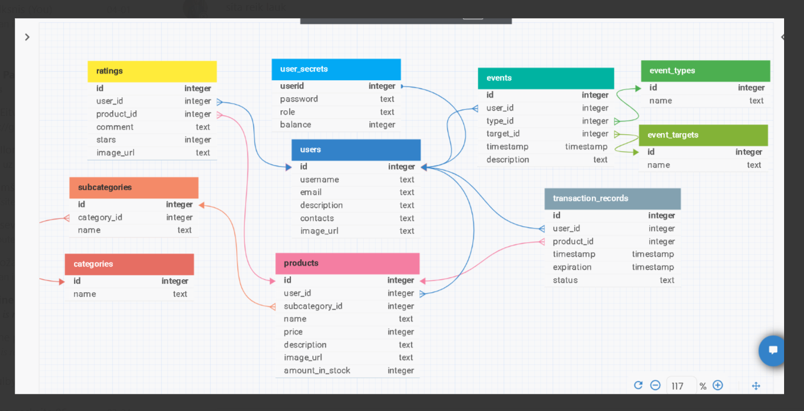

# TECHIN fullstack (PERN) project

User-driven marketplace platform "Just Do It"

## Table of contents

- [Abstract](#abstract)
- [Installation](#installation)
- [Usage](#usage)
- [API endpoints](#api-endpoints)
- [Frontend Components](#frontend-components)
- [Database Structure](#database-structure)
- [Technologies Used](#technologies-used)
- [Testing Plan](#testing-plan)
- [License](#license)

## Abstract

This project is a dynamic web-based marketplace platform that enables users to act both as buyers and sellers within a single account. The application features a modern homepage highlighting the most popular products, trending new items, top sellers, and emerging sellers to enhance user engagement. The system supports comprehensive product discovery tools, including category-based navigation, search functionality with filters, sorting, and pagination. Each user has a personalized account page for managing products, monitoring transactions, and exporting financial reports.

Users can create listings with image uploads, rate products, and leave image-enhanced reviews on purchased items. Balance management is integrated, allowing users to top up their accounts and use funds for purchases. A unique transaction system ensures secure and transparent order fulfillment: once a purchase is made, funds are held in escrow until a registered courier confirms delivery and marks the order as complete. This triggers the final transfer of funds to the seller. Users can cancel transactions while the order is pending pickup.

Administrators have full access to user and system management features, including user moderation and role assignment. The platform also includes a dedicated courier interface for order handling and delivery confirmation. The result is a robust and secure online shopping experience that balances user freedom with operational oversight.

## Installation

1. Clone the repository:

```bash
 git clone https://github.com/pavelgusev431/Pavasario-projektas.git
```

2. Install dependencies:

```bash
 npm install
```

3. Install PostgreSQL on your local machine

4. Create a local postgresql database

5. Navigate to _server -> .env_ file and change the required fields to the ones you have configured:

```
DB_NAME=your_database_name
DB_USER=your_database_user
DB_PASS=your_database_password
```

## Usage

This is a fullstack project, meaning you will have to run both the client and the server.
First, navigate to the server directory:

```bash
cd server
```

And run the following command:

```bash
npm run start
```

Then in a separate terminal navigate to the client directory:

```bash
cd client
```

And run the same command:

```bash
npm run start
```

If there are no errors - you have configured everything correctly and the web-app is working.
Now you can open [this url](http://localhost:5173) to see your started project online.

## API endpoints

If you've managed to successfully run the server part of the application, you can go [here](http://localhost:3000/api-docs) to see the full list of endpoints that are available. The app uses automatic API endpoint documentation through Swagger, and SwaggerUI to show that documentation in the browser.

## Frontend Components

- .src
    - Main.jsx
    - App.jsx/
        - Auth.jsx/
            - SubmitEmailForPasswordReset.jsx
            - ThemeToggleButton.jsx
        - PasswordReset.jsx
        - Home.jsx/
            - BannerCarousel.jsx
            - HighestRatedProducts.jsx
            - HotProducts.jsx
            - TrendingUserProducts.jsx
            - TopUserProducts.jsx
            - BackToTopButton.jsx
        - Contact.jsx
        - About.jsx
        - ProductList.jsx/
            - ProductCard.jsx
            - BackToTopButton.jsx
        - UserProducts.jsx/
            - ProductCard.jsx
            - BackToTopButton.jsx
        - ProductDetails.jsx/
            - ProductComments.jsx
        - ProductsPage.jsx/
            - ProductCard.jsx
        - ProductsDropdown.jsx
        - SearchedProducts.jsx/
            - ProductCard.jsx
            - BackToTopButton.jsx
        - CategoryProducts.jsx/
            - ProductCard.jsx
        - PublicUserProfile.jsx/
            - RatedProductsByUsername.jsx
        - TransactionsList.jsx
        - TransactionDetail.jsx
        - CourierDashboard.jsx
        - BalancePage.jsx
        - MyReviews.jsx/
            - ReviewCreateModal.jsx
        - AdminPanel.jsx
        - Profile.jsx/
            - ModalEmail.jsx
            - ModalUsername.jsx
            - ModalDescription.jsx
            - ModalContacts.jsx
            - ModalPassword.jsx
            - ModalPicture.jsx
        - MyProducts.jsx/
            - ProductCreateModal.jsx
            - MyProductList.jsx/
                - Sort.jsx
                - MyProduct.jsx/
                    - ProductEditModal.jsx
                    - ProductDeleteModal.jsx
        - NotFound.jsx

## Database Structure



## Technologies Used

Client:

- React (Vite)
- TailwindCSS
- axios
- moment
- nanoid
- js-sha1
- js-sha256
- js-cookie
- lodash (debounce)
- lightningcss
- heroicons
- FontAwesome

Server:

- Node.js
- Express.js
- fs
- nodemon
- sequelize
- pg/pg-hstore
- jsonwebtoken
- nanoid
- morgan
- multer
- js-sha1
- js-sha256
- swagger (autogen/ui-express)
- cors
- dotenv
- cookie-parser

Miscelanious:

- eslint
- prettier
- husky

## Testing Plan

The QA team's testing plan is available via [this link](https://vtmc-my.sharepoint.com/personal/ilona_akinca_stud_techin_lt/_layouts/15/onedrive.aspx?id=%2Fpersonal%2Filona%5Fakinca%5Fstud%5Ftechin%5Flt%2FDocuments%2Fupdated%20Just%5FDo%5FIT&ga=1).

## License

This project is licensed under the [MIT License](LICENSE).
